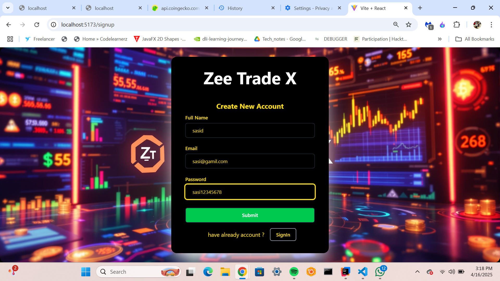
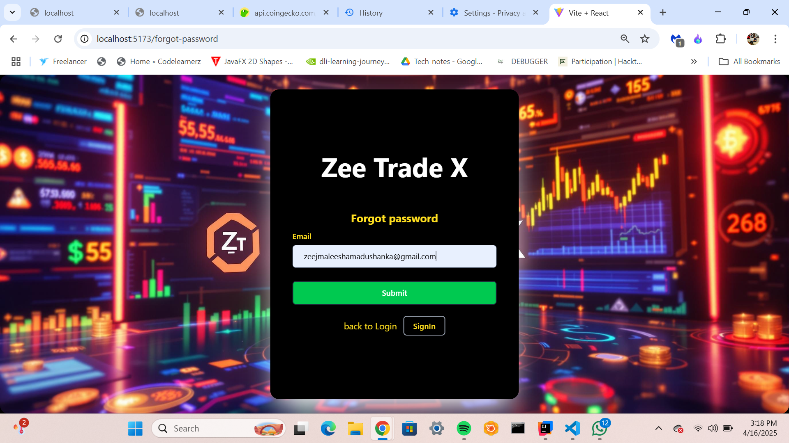
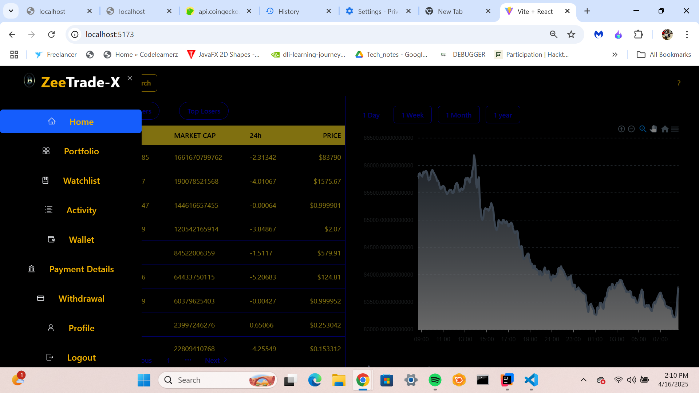
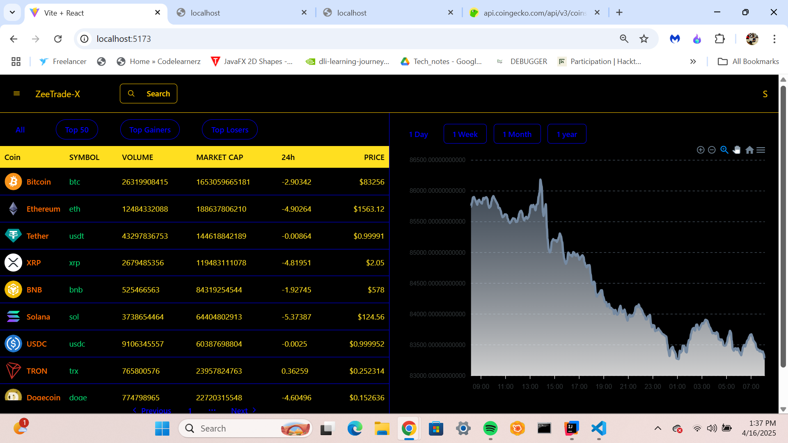
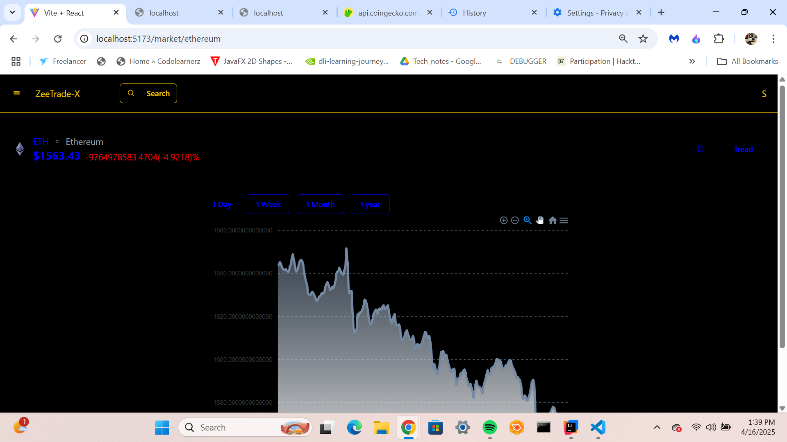
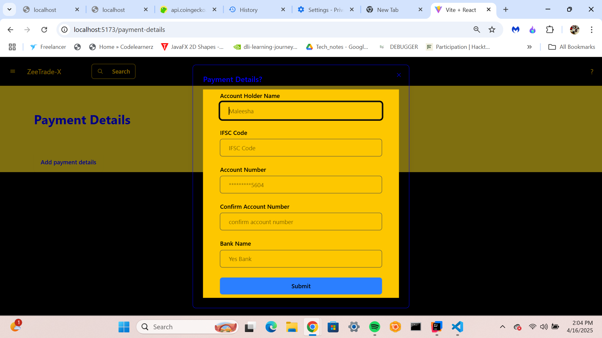

# React + Vite

## ZeeTradeX Frontend - React + Vite.js + Shadcn UI

## 📘 Project Description
This is the frontend of the **ZeeTradeX** cryptocurrency trading platform, built using **React.js** with **Vite.js** for fast development and performance. The UI is styled with the **Shadcn UI** library, and the frontend communicates with the Spring Boot backend via REST APIs.

Users can view real-time crypto prices (via CoinGecko API), buy/sell assets, manage their portfolio, and more.

---

## ✨ Key Features

- 🚀 **Built with Vite.js** for lightning-fast development
- 💅 **Shadcn UI** components for a sleek, modern interface
- 🔒 **User Authentication** (Register, Login, Forgot Password)
- 📊 **Trading Dashboard** with real-time crypto prices
- 💰 **Buy/Sell Crypto** and portfolio management
- 👤 **Profile management** for user information

---

## 📸 Screenshots

### 📝 Register Page


### 🔐 Login Page


### 🔑 Forgot Password Page


### 🏠 Home Page


### 📈 Trading Dashboard


### 📊 Coin Chart Page (e.g., Ethereum)


### 💳 Payment Details Page


---

## 🛠️ Setup Instructions

### 🧩 Prerequisites
- Node.js v16+ and npm
- Vite.js
- Internet connection (for CoinGecko API)
- Backend running (Spring Boot)

---

### 🔧 Installation & Running

1. **Clone the repository**:
   ```bash
   git clone https://github.com/MaleeshaMAdhushanka/ZeeTradex-ForntEnd.git

   cd ZeeTradex-ForntEnd

   
2. **Install dependencies:**:

 ```bash
  npm install

   npm run dev
   
   

## Project Documentation


### Class Structure
The class diagram showing the system's architecture and relationships can be found here:
[View Class Diagram](./src/assets/zeexmax.png)

## API Documentation

Detailed API documentation is available through Postman:
[View API Documentation](https://documenter.getpostman.com/view/37889199/2sB2cbaeW5)

## BackEnd Repository

The backend repository for this project can be found here:
[Zee Tradex Backend](https://github.com/MaleeshaMAdhushanka/ZeeTradex-ForntEnd.git)

   ```
